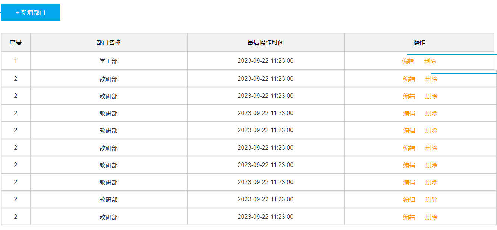

# 多表操作&员工列表查询

## 1. 多表关系

关于单表的操作(单表的设计、单表的增删改查)我们就已经学习完了。接下来我们就要来学习多表的操作，首先来学习多表的设计。

项目开发中，在进行数据库表结构设计时，会根据业务需求及业务模块之间的关系，分析并设计表结构，由于业务之间相互关联，所以各个表结构之间也存在着各种联系，基本上分为三种：

- 一对多(多对一)

- 多对多

- 一对一


### 2.1 一对多

#### 2.1.1 关系实现

- 场景：部门与员工的关系（一个部门下有多个员工）

- 员工管理页面原型：（前面已完成emp表结构设计）

​     

​	

- 部门管理页面原型：

​     


由于一个部门下，会关联多个员工。 而一个员工，是归属于某一个部门的 。那么此时，我们就需要在 `emp` 表中增加一个字段 `dept_id` 来标识这个员工属于哪一个部门，`dept_id` 关联的是 `dept` 的 `id` 。 如下所示：

 


上述的 `emp` 员工表的 `dept_id` 字段，关联的是 `dept` 部门表的 `id` 。部门表是一的一方，也称为 **父表**，员工表是多的一方，称之为 **子表**。

 


那接下来，我们就可以将上述的两张表创建出来。具体SQL语句如下所示：

```sql
CREATE TABLE dept (
  id int unsigned PRIMARY KEY AUTO_INCREMENT COMMENT 'ID, 主键',
  name varchar(10) NOT NULL UNIQUE COMMENT '部门名称',
  create_time datetime DEFAULT NULL COMMENT '创建时间',
  update_time datetime DEFAULT NULL COMMENT '修改时间'
) COMMENT '部门表';

INSERT INTO dept VALUES (1,'学工部','2023-09-25 09:47:40','2023-09-25 09:47:40'),
					(2,'教研部','2023-09-25 09:47:40','2023-10-09 15:17:04'),
					(3,'咨询部2','2023-09-25 09:47:40','2023-11-30 21:26:24'),
					(4,'就业部','2023-09-25 09:47:40','2023-09-25 09:47:40'),
					(5,'人事部','2023-09-25 09:47:40','2023-09-25 09:47:40'),
					(6,'行政部','2023-11-30 20:56:37','2023-11-30 20:56:37');

create table emp(
    id int unsigned primary key auto_increment comment 'ID,主键',
    username varchar(20) not null unique comment '用户名',
    password varchar(50) default '123456' comment '密码',
    name varchar(10) not null comment '姓名',
    gender tinyint unsigned not null comment '性别, 1:男, 2:女',
    phone char(11) not null unique comment '手机号',
    job tinyint unsigned comment '职位, 1 班主任, 2 讲师 , 3 学工主管, 4 教研主管, 5 咨询师',
    salary int unsigned comment '薪资',
    image varchar(300) comment '头像',
    entry_date date comment '入职日期',
    
    dept_id int unsigned comment '部门ID',  -- 部门ID， 关联部门表的ID字段
    
    create_time datetime comment '创建时间',
    update_time datetime comment '修改时间'
) comment '员工表';


INSERT INTO emp VALUES
(1,'shinaian','123456','施耐庵',1,'13309090001',4,15000,'5.png','2000-01-01',2,'2023-10-20 16:35:33','2023-11-16 16:11:26'),
(2,'songjiang','123456','宋江',1,'13309090002',2,8600,'01.png','2015-01-01',2,'2023-10-20 16:35:33','2023-10-20 16:35:37'),
(3,'lujunyi','123456','卢俊义',1,'13309090003',2,8900,'01.png','2008-05-01',2,'2023-10-20 16:35:33','2023-10-20 16:35:39'),
(4,'wuyong','123456','吴用',1,'13309090004',2,9200,'01.png','2007-01-01',2,'2023-10-20 16:35:33','2023-10-20 16:35:41'),
(5,'gongsunsheng','123456','公孙胜',1,'13309090005',2,9500,'01.png','2012-12-05',2,'2023-10-20 16:35:33','2023-10-20 16:35:43'),
(6,'huosanniang','123456','扈三娘',2,'13309090006',3,6500,'01.png','2013-09-05',1,'2023-10-20 16:35:33','2023-10-20 16:35:45'),
(7,'chaijin','123456','柴进',1,'13309090007',1,4700,'01.png','2005-08-01',1,'2023-10-20 16:35:33','2023-10-20 16:35:47'),
(8,'likui','123456','李逵',1,'13309090008',1,4800,'01.png','2014-11-09',1,'2023-10-20 16:35:33','2023-10-20 16:35:49'),
(9,'wusong','123456','武松',1,'13309090009',1,4900,'01.png','2011-03-11',1,'2023-10-20 16:35:33','2023-10-20 16:35:51'),
(10,'linchong','123456','林冲',1,'13309090010',1,5000,'01.png','2013-09-05',1,'2023-10-20 16:35:33','2023-10-20 16:35:53'),
(11,'huyanzhuo','123456','呼延灼',1,'13309090011',2,9700,'01.png','2007-02-01',2,'2023-10-20 16:35:33','2023-10-20 16:35:55'),
(12,'xiaoliguang','123456','小李广',1,'13309090012',2,10000,'01.png','2008-08-18',2,'2023-10-20 16:35:33','2023-10-20 16:35:57'),
(13,'yangzhi','123456','杨志',1,'13309090013',1,5300,'01.png','2012-11-01',1,'2023-10-20 16:35:33','2023-10-20 16:35:59'),
(14,'shijin','123456','史进',1,'13309090014',2,10600,'01.png','2002-08-01',2,'2023-10-20 16:35:33','2023-10-20 16:36:01'),
(15,'sunerniang','123456','孙二娘',2,'13309090015',2,10900,'01.png','2011-05-01',2,'2023-10-20 16:35:33','2023-10-20 16:36:03'),
(16,'luzhishen','123456','鲁智深',1,'13309090016',2,9600,'01.png','2010-01-01',2,'2023-10-20 16:35:33','2023-10-20 16:36:05'),
(17,'liying','12345678','李应',1,'13309090017',1,5800,'01.png','2015-03-21',1,'2023-10-20 16:35:33','2023-10-20 16:36:07'),
(18,'shiqian','123456','时迁',1,'13309090018',2,10200,'01.png','2015-01-01',2,'2023-10-20 16:35:33','2023-10-20 16:36:09'),
(19,'gudasao','123456','顾大嫂',2,'13309090019',2,10500,'01.png','2008-01-01',2,'2023-10-20 16:35:33','2023-10-20 16:36:11'),
(20,'ruanxiaoer','123456','阮小二',1,'13309090020',2,10800,'01.png','2018-01-01',2,'2023-10-20 16:35:33','2023-10-20 16:36:13'),
(21,'ruanxiaowu','123456','阮小五',1,'13309090021',5,5200,'01.png','2015-01-01',3,'2023-10-20 16:35:33','2023-10-20 16:36:15'),
(22,'ruanxiaoqi','123456','阮小七',1,'13309090022',5,5500,'01.png','2016-01-01',3,'2023-10-20 16:35:33','2023-10-20 16:36:17'),
(23,'ruanji','123456','阮籍',1,'13309090023',5,5800,'01.png','2012-01-01',3,'2023-10-20 16:35:33','2023-10-20 16:36:19'),
(24,'tongwei','123456','童威',1,'13309090024',5,5000,'01.png','2006-01-01',3,'2023-10-20 16:35:33','2023-10-20 16:36:21'),
(25,'tongmeng','123456','童猛',1,'13309090025',5,4800,'01.png','2002-01-01',3,'2023-10-20 16:35:33','2023-10-20 16:36:23'),
(26,'yanshun','123456','燕顺',1,'13309090026',5,5400,'01.png','2011-01-01',3,'2023-10-20 16:35:33','2023-11-08 22:12:46'),
(27,'lijun','123456','李俊',1,'13309090027',2,6600,'8.png','2004-01-01',2,'2023-10-20 16:35:33','2023-11-16 17:56:59'),
(28,'lizhong','123456','李忠',1,'13309090028',5,5000,'6.png','2007-01-01',3,'2023-10-20 16:35:33','2023-11-17 16:34:22'),
(30,'liyun','123456','李云',1,'13309090030',NULL,NULL,'01.png','2020-03-01',NULL,'2023-10-20 16:35:33','2023-10-20 16:36:31'),
(36,'linghuchong','123456','令狐冲',1,'18809091212',2,6800,'1.png','2023-10-19',2,'2023-10-20 20:44:54','2023-11-09 09:41:04');
```

> 问题：一对多的表关系，在数据库层面该如何实现 ？
>
> 在数据库表中多的一方，添加字段，来关联一的一方的主键 。


#### 2.1.2 外键约束

**问题**

表结构创建完毕后，我们看到两张表的数据分别为：

  

我们看到，在3号部门下，是关联的有7个员工。 当删除了3号部门后，数据变为：

  

3号部门被删除了，但是依然还有7个员工是属于3号部门的。 此时：就出现数据的不完整、不一致了。 


**问题分析**

**现象：**部门数据可以直接删除，然而还有部分员工归属于该部门下，此时就出现了数据的不完整、不一致问题 。

**原因：**目前上述的两张表(员工表、部门表)，在数据库层面，并未建立关联，所以是无法保证数据的一致性和完整性的


**问题解决**

想解决上述的问题呢，我们就可以通过数据库中的 **外键约束** 来解决。

 


> 外键约束：让两张表的数据建立连接，保证数据的一致性和完整性。  
>
> 对应的关键字：foreign key

外键约束的语法：

```mysql
-- 创建表时指定
create table 表名(
	字段名    数据类型,
	...
	[constraint]   [外键名称]  foreign  key (外键字段名)   references   主表 (主表列名)	
);


-- 建完表后，添加外键
alter table  表名  add constraint  外键名称  foreign key(外键字段名) references 主表(主表列名);
```

那接下来，我们就为员工表的dept_id 建立外键约束，来关联部门表的主键。


方式1：通过SQL语句操作

```mysql
-- 修改表： 添加外键约束
alter table tb_emp  add  constraint  fk_dept_id  foreign key (dept_id)  references  tb_dept(id);
```


方式2：图形化界面操作

  


当我们添加外键约束时，我们得保证当前数据库表中的数据是完整的。 所以，我们需要将之前删除掉的数据再添加回来。

当我们添加了外键之后，再删除ID为3的部门，就会发现，此时数据库报错了，不允许删除。


> 外键约束（foreign key）：保证了数据的完整性和一致性。


**物理外键和逻辑外键**

- 物理外键
  - 概念：使用foreign key定义外键关联另外一张表。
  - 缺点：
    - 影响增、删、改的效率（需要检查外键关系）。
    - 仅用于单节点数据库，不适用与分布式、集群场景。
    - 容易引发数据库的死锁问题，消耗性能。

- 逻辑外键
  - 概念：在业务层逻辑中，解决外键关联。
  - 通过逻辑外键，就可以很方便的解决上述问题。

> **在现在的企业开发中，很少会使用物理外键，都是使用逻辑外键。 甚至在一些数据库开发规范中，会明确指出禁止使用物理外键 foreign key **


### 2.2 一对一

一对一关系表在实际开发中应用起来比较简单，通常是用来做单表的拆分，也就是将一张大表拆分成两张小表，将大表中的一些基础字段放在一张表当中，将其他的字段放在另外一张表当中，以此来提高数据的操作效率。

一对一的应用场景： 用户表(基本信息+身份信息)


- 基本信息：用户的ID、姓名、性别、手机号、学历
- 身份信息：民族、生日、身份证号、身份证签发机关，身份证的有效期(开始时间、结束时间)

 如果在业务系统当中，对用户的基本信息查询频率特别的高，但是对于用户的身份信息查询频率很低，此时出于提高查询效率的考虑，我就可以将这张大表拆分成两张小表，第一张表存放的是用户的基本信息，而第二张表存放的就是用户的身份信息。他们两者之间一对一的关系，一个用户只能对应一个身份证，而一个身份证也只能关联一个用户。


那么在数据库层面怎么去体现上述两者之间是一对一的关系呢？

其实一对一我们可以看成一种特殊的一对多。一对多我们是怎么设计表关系的？是不是在多的一方添加外键。同样我们也可以通过外键来体现一对一之间的关系，我们只需要在任意一方来添加一个外键就可以了。

 


SQL脚本：

~~~mysql
-- 用户基本信息表
create table tb_user(
    id int unsigned  primary key auto_increment comment 'ID',
    name varchar(10) not null comment '姓名',
    gender tinyint unsigned not null comment '性别, 1 男  2 女',
    phone char(11) comment '手机号',
    degree varchar(10) comment '学历'
) comment '用户基本信息表';
-- 测试数据
insert into tb_user values (1,'白眉鹰王',1,'18812340001','初中'),
                        (2,'青翼蝠王',1,'18812340002','大专'),
                        (3,'金毛狮王',1,'18812340003','初中'),
                        (4,'紫衫龙王',2,'18812340004','硕士');

-- 用户身份信息表
create table tb_user_card(
    id int unsigned  primary key auto_increment comment 'ID',
    nationality varchar(10) not null comment '民族',
    birthday date not null comment '生日',
    idcard char(18) not null comment '身份证号',
    issued varchar(20) not null comment '签发机关',
    expire_begin date not null comment '有效期限-开始',
    expire_end date comment '有效期限-结束',
    user_id int unsigned not null unique comment '用户ID',
    constraint fk_user_id foreign key (user_id) references tb_user(id)
) comment '用户身份信息表';
-- 测试数据
insert into tb_user_card values (1,'汉','1960-11-06','100000100000100001','朝阳区公安局','2000-06-10',null,1),
        (2,'汉','1971-11-06','100000100000100002','静安区公安局','2005-06-10','2025-06-10',2),
        (3,'汉','1963-11-06','100000100000100003','昌平区公安局','2006-06-10',null,3),
        (4,'回','1980-11-06','100000100000100004','海淀区公安局','2008-06-10','2028-06-10',4);
~~~

> 一对一 ：在任意一方加入外键，关联另外一方的主键，并且设置外键为唯一的(UNIQUE)
>


### 2.3 多对多

多对多的关系在开发中属于也比较常见的。比如：学生和老师的关系，一个学生可以有多个授课老师，一个授课老师也可以有多个学生。在比如：学生和课程的关系，一个学生可以选修多门课程，一个课程也可以供多个学生选修。

案例：学生与课程的关系

- 关系：一个学生可以选修多门课程，一门课程也可以供多个学生选择

- 实现关系：建立第三张中间表，中间表至少包含两个外键，分别关联两方主键

 


SQL脚本：

~~~mysql
-- 学生表
create table tb_student(
    id int auto_increment primary key comment '主键ID',
    name varchar(10) comment '姓名',
    no varchar(10) comment '学号'
) comment '学生表';
-- 学生表测试数据
insert into tb_student(name, no) 
			values ('黛绮丝', '2000100101'),('谢逊', '2000100102'),('殷天正', '2000100103'),('韦一笑', '2000100104');

-- 课程表
create table tb_course(
   id int auto_increment primary key comment '主键ID',
   name varchar(10) comment '课程名称'
) comment '课程表';
-- 课程表测试数据
insert into tb_course (name) values ('Java'), ('PHP'), ('MySQL') , ('Hadoop');

-- 学生课程表（中间表）
create table tb_student_course(
   id int auto_increment comment '主键' primary key,
   student_id int not null comment '学生ID',
   course_id  int not null comment '课程ID',
   constraint fk_courseid foreign key (course_id) references tb_course (id),
   constraint fk_studentid foreign key (student_id) references tb_student (id)
)comment '学生课程中间表';

-- 学生课程表测试数据
insert into tb_student_course(student_id, course_id) values (1,1),(1,2),(1,3),(2,2),(2,3),(3,4);
~~~


### 2.4 案例

下面通过一个综合案例加深对于多表关系的理解，并掌握多表设计的流程。

**需求**

- 根据参考资料中提供的《Talis智能学习辅助系统》页面原型，设计员工管理模块涉及到的表结构。


**步骤**

1. 阅读页面原型及需求文档，分析各个模块涉及到的表结构，及表结构之间的关系。

2. 根据页面原型及需求文档，分析各个表结构中具体的字段及约束。


**分析**

- 页面原型-部门管理

​	      

​		 部门管理涉及到一张部门表，这个前面我们都已经设计过了。 无需再进行设计了。

​		

- 页面原型-员工管理

​		  

​		上述在员工列表查询的页面原型，当我们点击 "新增员工" 按钮时，会弹出一个新增员工的表单，表单展示形式如下：

​		  

​		在上述的页面原型中，我们可以看到，每一个员工是归属于某一个部门的，而一个部门下可以有多个员工，所以部门与员工之间的关系是一对多的关系。

​		从页面员工中，我们可以看到，员工还有工作经历的信息。而每一个员工，是可以添加多个工作经历的。 所以，工作经历我们可以再设计一张表，而员工与员工的工作经历之间的关系，是一对多的关系。

​		

​		最终，具体的表结构如下：

```sql
-- 部门表
create table dept (
  id int unsigned PRIMARY KEY AUTO_INCREMENT COMMENT 'ID, 主键',
  name varchar(10) NOT NULL UNIQUE COMMENT '部门名称',
  create_time datetime DEFAULT NULL COMMENT '创建时间',
  update_time datetime DEFAULT NULL COMMENT '修改时间'
) COMMENT '部门表';

-- 员工表
create table emp(
    id int unsigned primary key auto_increment comment 'ID,主键',
    username varchar(20) not null unique comment '用户名',
    password varchar(50) default '123456' comment '密码',
    name varchar(10) not null comment '姓名',
    gender tinyint unsigned not null comment '性别, 1:男, 2:女',
    phone char(11) not null unique comment '手机号',
    job tinyint unsigned comment '职位, 1 班主任, 2 讲师 , 3 学工主管, 4 教研主管, 5 咨询师',
    salary int unsigned comment '薪资',
    image varchar(300) comment '头像',
    entry_date date comment '入职日期',
    dept_id int unsigned comment '部门ID',  -- 关联的是dept部门表的ID
    create_time datetime comment '创建时间',
    update_time datetime comment '修改时间'
) comment '员工表';

-- 员工工作经历表
create table emp_expr(
    id int unsigned primary key auto_increment comment 'ID, 主键',
    emp_id  int unsigned null comment '员工ID', -- 关联的是emp员工表的ID
    begin  date null comment '开始时间',
    end date null comment '结束时间',
    company varchar(50) null comment '公司名称',
    job varchar(50) null comment '职位'
) comment '工作经历';
```


> 注意：在上述的表结构设计中，我们使用的都是逻辑外键。


## 2. 多表查询

### 2.1 概述

#### 2.1.1 数据准备

SQL脚本：

~~~mysql
-- 部门管理
create table dept(
    id int unsigned primary key auto_increment comment 'ID, 主键',
    name varchar(10) not null unique comment '部门名称',
    create_time datetime comment '创建时间',
    update_time datetime comment '修改时间'
) comment '部门表' ;

insert into dept (id, name, create_time, update_time) values
        (1,'学工部',now(),now()),
        (2,'教研部',now(),now()),
        (3,'咨询部',now(),now()),
        (4,'就业部',now(),now()),
        (5,'人事部',now(),now()),
	    (6,'行政部',now(),now());

-- 员工管理
create table emp(
    id int unsigned primary key auto_increment comment 'ID,主键',
    username varchar(20) not null unique comment '用户名',
    password varchar(32) not null comment '密码',
    name varchar(10) not null comment '姓名',
    gender tinyint unsigned not null comment '性别, 1:男, 2:女',
    phone char(11) not null unique comment '手机号',
    job tinyint unsigned comment '职位, 1:班主任,2:讲师,3:学工主管,4:教研主管,5:咨询师',
    salary int unsigned comment '薪资',
    image varchar(300) comment '头像',
    entry_date date comment '入职日期',
    dept_id int unsigned COMMENT '关联的部门ID',
    create_time datetime comment '创建时间',
    update_time datetime comment '修改时间'
) comment '员工表';


-- 准备测试数据
INSERT INTO `emp` VALUES 
(1,'shinaian','123456','施耐庵',1,'13309090001',4,15000,'01.png','2000-01-01',2,'2023-10-27 16:35:33','2023-10-27 16:35:35'),
(2,'songjiang','123456','宋江',1,'13309090002',2,8600,'01.png','2015-01-01',2,'2023-10-27 16:35:33','2023-10-27 16:35:37'),
(3,'lujunyi','123456','卢俊义',1,'13309090003',2,8900,'01.png','2008-05-01',2,'2023-10-27 16:35:33','2023-10-27 16:35:39'),
(4,'wuyong','123456','吴用',1,'13309090004',2,9200,'01.png','2007-01-01',2,'2023-10-27 16:35:33','2023-10-27 16:35:41'),(5,'gongsunsheng','123456','公孙胜',1,'13309090005',2,9500,'01.png','2012-12-05',2,'2023-10-27 16:35:33','2023-10-27 16:35:43'),
(6,'huosanniang','123456','扈三娘',2,'13309090006',3,6500,'01.png','2013-09-05',1,'2023-10-27 16:35:33','2023-10-27 16:35:45'),
(7,'chaijin','123456','柴进',1,'13309090007',1,4700,'01.png','2005-08-01',1,'2023-10-27 16:35:33','2023-10-27 16:35:47'),
(8,'likui','123456','李逵',1,'13309090008',1,4800,'01.png','2014-11-09',1,'2023-10-27 16:35:33','2023-10-27 16:35:49'),
(9,'wusong','123456','武松',1,'13309090009',1,4900,'01.png','2011-03-11',1,'2023-10-27 16:35:33','2023-10-27 16:35:51'),
(10,'lichong','123456','林冲',1,'13309090010',1,5000,'01.png','2013-09-05',1,'2023-10-27 16:35:33','2023-10-27 16:35:53'),
(11,'huyanzhuo','123456','呼延灼',1,'13309090011',2,9700,'01.png','2007-02-01',2,'2023-10-27 16:35:33','2023-10-27 16:35:55'),
(12,'xiaoliguang','123456','小李广',1,'13309090012',2,10000,'01.png','2008-08-18',2,'2023-10-27 16:35:33','2023-10-27 16:35:57'),
(13,'yangzhi','123456','杨志',1,'13309090013',1,5300,'01.png','2012-11-01',1,'2023-10-27 16:35:33','2023-10-27 16:35:59'),
(14,'shijin','123456','史进',1,'13309090014',2,10600,'01.png','2002-08-01',2,'2023-10-27 16:35:33','2023-10-27 16:36:01'),
(15,'sunerniang','123456','孙二娘',2,'13309090015',2,10900,'01.png','2011-05-01',2,'2023-10-27 16:35:33','2023-10-27 16:36:03'),
(16,'luzhishen','123456','鲁智深',1,'13309090016',2,9600,'01.png','2010-01-01',2,'2023-10-27 16:35:33','2023-10-27 16:36:05'),
(17,'liying','12345678','李应',1,'13309090017',1,5800,'01.png','2015-03-21',1,'2023-10-27 16:35:33','2023-10-27 16:36:07'),
(18,'shiqian','123456','时迁',1,'13309090018',2,10200,'01.png','2015-01-01',2,'2023-10-27 16:35:33','2023-10-27 16:36:09'),
(19,'gudasao','123456','顾大嫂',2,'13309090019',2,10500,'01.png','2008-01-01',2,'2023-10-27 16:35:33','2023-10-27 16:36:11'),
(20,'ruanxiaoer','123456','阮小二',1,'13309090020',2,10800,'01.png','2018-01-01',2,'2023-10-27 16:35:33','2023-10-27 16:36:13'),
(21,'ruanxiaowu','123456','阮小五',1,'13309090021',5,5200,'01.png','2015-01-01',3,'2023-10-27 16:35:33','2023-10-27 16:36:15'),
(22,'ruanxiaoqi','123456','阮小七',1,'13309090022',5,5500,'01.png','2016-01-01',3,'2023-10-27 16:35:33','2023-10-27 16:36:17'),
(23,'ruanji','123456','阮籍',1,'13309090023',5,5800,'01.png','2012-01-01',3,'2023-10-27 16:35:33','2023-10-27 16:36:19'),
(24,'tongwei','123456','童威',1,'13309090024',5,5000,'01.png','2006-01-01',3,'2023-10-27 16:35:33','2023-10-27 16:36:21'),
(25,'tongmeng','123456','童猛',1,'13309090025',5,4800,'01.png','2002-01-01',3,'2023-10-27 16:35:33','2023-10-27 16:36:23'),
(26,'yanshun','123456','燕顺',1,'13309090026',5,5400,'01.png','2011-01-01',3,'2023-10-27 16:35:33','2023-10-27 16:36:25'),
(27,'lijun','123456','李俊',1,'13309090027',5,6600,'01.png','2004-01-01',3,'2023-10-27 16:35:33','2023-10-27 16:36:27'),
(28,'lizhong','123456','李忠',1,'13309090028',5,5000,'01.png','2007-01-01',3,'2023-10-27 16:35:33','2023-10-27 16:36:29'),
(29,'songqing','123456','宋清',1,'13309090029',NULL,5100,'01.png','2020-01-01',NULL,'2023-10-27 16:35:33','2023-10-27 16:36:31'),
(30,'liyun','123456','李云',1,'13309090030',NULL,NULL,'01.png','2020-03-01',NULL,'2023-10-27 16:35:33','2023-10-27 16:36:31');
~~~


#### 2.1.2 介绍

多表查询：查询时从多张表中获取所需数据

> 单表查询的SQL语句：select  字段列表  from  表名;
>
> 那么要执行多表查询，只需要使用逗号分隔多张表即可，如： select   字段列表  from  表1, 表2;

查询用户表和部门表中的数据：

~~~mysql
select * from  emp , dept;
~~~

 

此时，我们看到查询结果中包含了大量的结果集，总共`180`条记录，而这其实就是员工表所有的记录(30行)与部门表所有记录(6行)的所有组合情况，这种现象称之为**笛卡尔积**。


**笛卡尔积：**笛卡尔乘积是指在数学中，两个集合(A集合和B集合)的所有组合情况。

 

在多表查询时，需要消除无效的笛卡尔积，只保留表关联部分的数据。

 

在SQL语句中，如何去除无效的笛卡尔积呢？只需要给多表查询加上连接查询的条件即可。

~~~mysql
select * from emp , dept where emp.dept_id = dept.id ;
~~~

  

这样，我们就查询出来了所有的员工，及其这个员工所属的部门信息。 而由于id为29、30的员工，没有dept_id字段值，所以在多表查询时，根据连接查询的条件并没有查询到。


#### 2.1.3 分类

多表查询可以分为：

​	 

1. 连接查询

   - 内连接：相当于查询A、B交集部分数据
   - 外连接
     - 左外连接：查询左表所有数据(包括两张表交集部分数据)

     - 右外连接：查询右表所有数据(包括两张表交集部分数据)

2. 子查询


### 2.2 内连接

内连接查询：查询两表或多表中交集部分数据。

内连接从语法上可以分为：

- 隐式内连接

- 显式内连接


**隐式内连接语法：**

``` mysql
select  字段列表   from   表1 , 表2   where  条件 ... ;
```

**显式内连接语法：**

``` mysql
select  字段列表   from   表1  [ inner ]  join 表2  on  连接条件 ... ;
```


案例1：查询所有员工的ID，姓名，及所属的部门名称

- 隐式内连接实现

~~~mysql
select emp.id, emp.name, dept.name from emp , dept where emp.dept_id = dept.id;
~~~


- 显式内连接实现

~~~mysql
select emp.id, emp.name, dept.name from emp inner join dept on emp.dept_id = dept.id;
~~~


案例2：查询 性别为男, 且工资 高于8000 的员工的ID, 姓名, 及所属的部门名称

- 隐式内连接实现

~~~mysql
select emp.id, emp.name, dept.name from emp , dept where emp.dept_id = dept.id and emp.gender = 1 and emp.salary > 8000;
~~~


- 显式内连接实现

~~~mysql
select emp.id, emp.name, dept.name from emp inner join dept on emp.dept_id = dept.id where emp.gender = 1 and emp.salary > 8000;
~~~


> 在多表联查时，我们指定字段时，需要在字段名前面加上表名，来指定具体是哪一张的字段。 如：emp.dept_id


**给表起别名简化书写：**

```sql
select  字段列表 from 表1 as 别名1 , 表2 as  别名2  where  条件 ... ;

select  字段列表 from 表1 别名1 , 表2  别名2  where  条件 ... ;  -- as 可以省略
```


多表查询时给表起别名：

- tableA  as  别名1  ,  tableB  as  别名2 ;

- tableA  别名1  ,  tableB  别名2 ;


使用了别名的多表查询：

~~~mysql
select e.id, e.name, d.name from emp as e , dept as d where e.dept_id = d.id and e.gender = 1 and e.salary > 8000;
~~~

> 注意事项:
>
> 一旦为表起了别名，就不能再使用表名来指定对应的字段了，此时只能够使用别名来指定字段。


### 2.3 外连接

外连接分为两种：左外连接 和 右外连接。

**左外连接语法：**

```mysql
select  字段列表   from   表1  left  [ outer ]  join 表2  on  连接条件 ... ;
```

> 左外连接相当于查询表1(左表)的所有数据，当然也包含表1和表2交集部分的数据。

**右外连接语法：**

```mysql
select  字段列表   from   表1  right  [ outer ]  join 表2  on  连接条件 ... ;
```

> 右外连接相当于查询表2(右表)的所有数据，当然也包含表1和表2交集部分的数据。


案例1：查询员工表 所有 员工的姓名, 和对应的部门名称 (左外连接)

~~~mysql
-- 左外连接：以left join关键字左边的表为主表，查询主表中所有数据，以及和主表匹配的右边表中的数据
select e.name , d.name  from emp as e left join dept as d on e.dept_id = d.id ;
~~~


案例2：查询部门表 所有 部门的名称, 和对应的员工名称 (右外连接)

```sql
-- 右外连接：以right join关键字右边的表为主表，查询主表中所有数据，以及和主表匹配的左边表中的数据
select e.name , d.name from emp as e right join dept as d on e.dept_id = d.id;
```


案例3：查询工资 高于8000 的 所有员工的姓名, 和对应的部门名称 (左外连接)

~~~mysql
select e.name , d.name  from emp as e left join dept as d on e.dept_id = d.id where e.salary > 8000;
~~~


> 注意事项：
>
> ​		左外连接和右外连接是可以相互替换的，只需要调整连接查询时SQL语句中表的先后顺序就可以了。而我们在日常开发使用时，更偏向于左外连接。


### 2.4 子查询

#### 2.4.1 介绍

SQL语句中嵌套select语句，称为嵌套查询，又称子查询。

```sql
SELECT  *  FROM   t1   WHERE  column1 =  ( SELECT  column1  FROM  t2 ... );
```

> 子查询外部的语句可以是insert / update / delete / select 的任何一个，最常见的是 select。


根据子查询结果的不同分为：

1. 标量子查询（子查询结果为单个值[一行一列]）

2. 列子查询（子查询结果为一列，但可以是多行）

3. 行子查询（子查询结果为一行，但可以是多列）

4. 表子查询（子查询结果为多行多列[相当于子查询结果是一张表]）

子查询可以书写的位置：

1. where之后
2. from之后
3. select之后

> 子查询的要点是，先对需求做拆分，明确具体的步骤，然后再逐条编写SQL语句。 最终将多条SQL语句合并为一条。
>


#### 2.4.2 标量子查询

子查询返回的结果是单个值(数字、字符串、日期等)，最简单的形式，这种子查询称为**标量子查询**。

常用的操作符： =   <>   >    >=    <   <=   


案例1：查询 最早入职 的员工信息

```mysql
-- 1. 查询最早的入职时间
select min(entry_date) from emp;  -- 结果: 2000-01-01

-- 2. 查询入职时间 = 最早入职时间的员工信息
select * from emp where entry_date = '2000-01-01';

-- 3. 合并为一条SQL
select * from emp where entry_date = (select min(entry_date) from emp);
```


案例2：查询在 阮小五 入职之后入职的员工信息

```mysql
-- 1. 查询 "阮小五" 的入职日期
select entry_date from emp where name = '阮小五'; -- 结果: 2015-01-01

-- 2. 根据上述查询到的这个入职日期, 查询在该日期之后入职的员工信息
select * from emp where entry_date > '2015-01-01';

-- 3. 合并SQL为一条SQL
select * from emp where entry_date > (select entry_date from emp where name = '阮小五');
```


#### 2.4.3 列子查询

子查询返回的结果是一列(可以是多行)，这种子查询称为列子查询。

常用的操作符：

| **操作符** | **描述**                     |
| ---------- | ---------------------------- |
| IN         | 在指定的集合范围之内，多选一 |
| NOT IN     | 不在指定的集合范围之内       |


案例1：查询 "教研部" 和 "咨询部" 的所有员工信息

```mysql
-- 1. 查询 "教研部" 和 "咨询部" 的部门ID
select id from dept where name = '教研部' or name = '咨询部'; -- 结果: 3,2

-- 2. 根据上面查询出来的部门ID, 查询员工信息
select * from emp where dept_id in(3,2);

-- 3. 合并SQL为一条SQL语句
select * from emp where dept_id in (select id from dept where name = '教研部' or name = '咨询部');
```


#### 2.4.4 行子查询

子查询返回的结果是一行(可以是多列)，这种子查询称为行子查询。

常用的操作符：= 、<> 、IN 、NOT IN


案例1：查询与 "李忠" 的薪资 及 职位都相同的员工信息

```mysql
-- 1. 查询 "李忠" 的薪资和职位
select salary , job from emp where name = '李忠'; -- 结果: 5000, 5

-- 2. 根据上述查询到的薪资和职位 , 查询对应员工的信息
select * from emp where (salary, job) = (5000,5);

-- 3. 将两条SQL合并为一条SQL
select * from emp where (salary, job) = (select salary , job from emp where name = '李忠');
```


#### 2.4.5 表子查询

子查询返回的结果是多行多列，常作为临时表，这种子查询称为表子查询。


案例：查询入职日期是 "2006-01-01" 之后的员工信息 , 及其部门信息

~~~mysql
-- 1. 查询入职日期是 "2006-01-01" 之后的员工信息
select * from emp where entry_date > '2006-01-01';

-- 2. 把上面查询的结果, 当做一张表 , 联查部门表
select e.*, d.name from (select * from emp where entry_date > '2006-01-01') as e , dept as d where e.dept_id = d.id;
~~~


### 2.5 案例

根据需求，完成多表查询的SQL语句的编写。

1. 查询 "教研部" 的 "男性" 员工，且在 "2011-05-01" 之后入职的员工信息 。

   ```sql
   select e.* from emp as e , dept as d where e.dept_id = d.id and d.name = '教研部' and e.gender = 1 and e.entry_date > '2011-05-01';
   ```

​			

2. 查询工资 低于公司平均工资的 且 性别为男 的员工信息 。

   ```sql
   select e.* from emp as e , dept as d where e.dept_id = d.id and e.salary < (select avg(salary) from emp) and e.gender = 1;
   ```

   

3. 查询工资 低于本部门平均工资的员工信息 。

   ```sql
   -- 查询1号部门的平均薪资
   select avg(salary) from emp where dept_id = 1;
   select avg(salary) from emp where dept_id = 1;
   select avg(salary) from emp where dept_id = 1;
   
   -- 查询工资 低于本部门平均工资的员工信息 。
   select * from emp as e where salary < (select avg(salary) from emp where dept_id = e.dept_id);
   ```

   

4. 查询部门人数超过 10 人的部门名称 。

   ```sql
   select d.name , count(*) from emp as e , dept as d where e.dept_id = d.id group by d.name having count(*) > 10;
   ```

   


## 3. 员工列表查询

那接下来，我们要来完成的是员工列表的查询功能实现。 具体的需求如下：

 

在查询员工列表数据时，既需要查询 员工的基本信息，还需要查询员工所属的部门名称，所以这里呢，会涉及到多表查询的操作。

而且，在查询员工列表数据时，既要考虑搜索栏中的查询条件，还要考虑对查询的结果进行分页处理。

那么接下来，我们在实现这个功能时，将会分为三个部分来逐一实现：

- 基本查询
- 分页查询
- 条件分页查询


### 3.1 环境准备

1). 准备数据库表 `emp(员工表)`  `emp_expr(员工工作经历表)`

```sql
-- 员工表
create table emp(
    id int unsigned primary key auto_increment comment 'ID,主键',
    username varchar(20) not null unique comment '用户名',
    password varchar(50) default '123456' comment '密码',
    name varchar(10) not null comment '姓名',
    gender tinyint unsigned not null comment '性别, 1:男, 2:女',
    phone char(11) not null unique comment '手机号',
    job tinyint unsigned comment '职位, 1 班主任, 2 讲师 , 3 学工主管, 4 教研主管, 5 咨询师',
    salary int unsigned comment '薪资',
    image varchar(300) comment '头像',
    entry_date date comment '入职日期',
    dept_id int unsigned comment '部门ID',
    create_time datetime comment '创建时间',
    update_time datetime comment '修改时间'
) comment '员工表';


INSERT INTO emp VALUES 
(1,'shinaian','123456','施耐庵',1,'13309090001',4,15000,'5.png','2000-01-01',2,'2023-10-20 16:35:33','2023-11-16 16:11:26'),
(2,'songjiang','123456','宋江',1,'13309090002',2,8600,'01.png','2015-01-01',2,'2023-10-20 16:35:33','2023-10-20 16:35:37'),
(3,'lujunyi','123456','卢俊义',1,'13309090003',2,8900,'01.png','2008-05-01',2,'2023-10-20 16:35:33','2023-10-20 16:35:39'),
(4,'wuyong','123456','吴用',1,'13309090004',2,9200,'01.png','2007-01-01',2,'2023-10-20 16:35:33','2023-10-20 16:35:41'),
(5,'gongsunsheng','123456','公孙胜',1,'13309090005',2,9500,'01.png','2012-12-05',2,'2023-10-20 16:35:33','2023-10-20 16:35:43'),
(6,'huosanniang','123456','扈三娘',2,'13309090006',3,6500,'01.png','2013-09-05',1,'2023-10-20 16:35:33','2023-10-20 16:35:45'),
(7,'chaijin','123456','柴进',1,'13309090007',1,4700,'01.png','2005-08-01',1,'2023-10-20 16:35:33','2023-10-20 16:35:47'),
(8,'likui','123456','李逵',1,'13309090008',1,4800,'01.png','2014-11-09',1,'2023-10-20 16:35:33','2023-10-20 16:35:49'),
(9,'wusong','123456','武松',1,'13309090009',1,4900,'01.png','2011-03-11',1,'2023-10-20 16:35:33','2023-10-20 16:35:51'),
(10,'linchong','123456','林冲',1,'13309090010',1,5000,'01.png','2013-09-05',1,'2023-10-20 16:35:33','2023-10-20 16:35:53'),
(11,'huyanzhuo','123456','呼延灼',1,'13309090011',2,9700,'01.png','2007-02-01',2,'2023-10-20 16:35:33','2023-10-20 16:35:55'),
(12,'xiaoliguang','123456','小李广',1,'13309090012',2,10000,'01.png','2008-08-18',2,'2023-10-20 16:35:33','2023-10-20 16:35:57'),
(13,'yangzhi','123456','杨志',1,'13309090013',1,5300,'01.png','2012-11-01',1,'2023-10-20 16:35:33','2023-10-20 16:35:59'),
(14,'shijin','123456','史进',1,'13309090014',2,10600,'01.png','2002-08-01',2,'2023-10-20 16:35:33','2023-10-20 16:36:01'),
(15,'sunerniang','123456','孙二娘',2,'13309090015',2,10900,'01.png','2011-05-01',2,'2023-10-20 16:35:33','2023-10-20 16:36:03'),
(16,'luzhishen','123456','鲁智深',1,'13309090016',2,9600,'01.png','2010-01-01',2,'2023-10-20 16:35:33','2023-10-20 16:36:05'),
(17,'liying','12345678','李应',1,'13309090017',1,5800,'01.png','2015-03-21',1,'2023-10-20 16:35:33','2023-10-20 16:36:07'),
(18,'shiqian','123456','时迁',1,'13309090018',2,10200,'01.png','2015-01-01',2,'2023-10-20 16:35:33','2023-10-20 16:36:09'),
(19,'gudasao','123456','顾大嫂',2,'13309090019',2,10500,'01.png','2008-01-01',2,'2023-10-20 16:35:33','2023-10-20 16:36:11'),
(20,'ruanxiaoer','123456','阮小二',1,'13309090020',2,10800,'01.png','2018-01-01',2,'2023-10-20 16:35:33','2023-10-20 16:36:13'),
(21,'ruanxiaowu','123456','阮小五',1,'13309090021',5,5200,'01.png','2015-01-01',3,'2023-10-20 16:35:33','2023-10-20 16:36:15'),
(22,'ruanxiaoqi','123456','阮小七',1,'13309090022',5,5500,'01.png','2016-01-01',3,'2023-10-20 16:35:33','2023-10-20 16:36:17'),
(23,'ruanji','123456','阮籍',1,'13309090023',5,5800,'01.png','2012-01-01',3,'2023-10-20 16:35:33','2023-10-20 16:36:19'),
(24,'tongwei','123456','童威',1,'13309090024',5,5000,'01.png','2006-01-01',3,'2023-10-20 16:35:33','2023-10-20 16:36:21'),
(25,'tongmeng','123456','童猛',1,'13309090025',5,4800,'01.png','2002-01-01',3,'2023-10-20 16:35:33','2023-10-20 16:36:23'),
(26,'yanshun','123456','燕顺',1,'13309090026',5,5400,'01.png','2011-01-01',3,'2023-10-20 16:35:33','2023-11-08 22:12:46'),
(27,'lijun','123456','李俊',1,'13309090027',2,6600,'8.png','2004-01-01',2,'2023-10-20 16:35:33','2023-11-16 17:56:59'),
(28,'lizhong','123456','李忠',1,'13309090028',5,5000,'6.png','2007-01-01',3,'2023-10-20 16:35:33','2023-11-17 16:34:22'),
(30,'liyun','123456','李云',1,'13309090030',NULL,NULL,'01.png','2020-03-01',NULL,'2023-10-20 16:35:33','2023-10-20 16:36:31'),
(36,'linghuchong','123456','令狐冲',1,'18809091212',2,6800,'1.png','2023-10-19',2,'2023-10-20 20:44:54','2023-11-09 09:41:04');


-- 员工工作经历信息
create table emp_expr(
    id int unsigned primary key auto_increment comment 'ID, 主键',
    emp_id int unsigned comment '员工ID',
    begin date comment '开始时间',
    end  date comment '结束时间',
    company varchar(50) comment '公司名称',
    job varchar(50) comment '职位'
)comment '工作经历';
```


2). 准备与表结构对应的实体类 (资料中提供了, 直接引入到项目中)

```java
/**
 * 员工信息
 */
@Data
public class Emp {
    private Integer id; //ID,主键
    private String username; //用户名
    private String password; //密码
    private String name; //姓名
    private Integer gender; //性别, 1:男, 2:女
    private String phone; //手机号
    private Integer job; //职位, 1:班主任,2:讲师,3:学工主管,4:教研主管,5:咨询师
    private Integer salary; //薪资
    private String image; //头像
    private LocalDate entryDate; //入职日期
    private Integer deptId; //关联的部门ID
    private LocalDateTime createTime; //创建时间
    private LocalDateTime updateTime; //修改时间

    //封装部门名称数
    private String deptName; //部门名称
}
```

```java
/**
 * 工作经历
 */
@Data
public class EmpExpr {
    private Integer id; //ID
    private Integer empId; //员工ID
    private LocalDate begin; //开始时间
    private LocalDate end; //结束时间
    private String company; //公司名称
    private String job; //职位
}
```


### 3.2 基本查询

那接下来，我们就先考虑一下要查询所有的员工数据，及其关联的部门名称，这个SQL语句该如何实现 ？ 

这里，要查询所有的员工，也就意味着，即使员工没有部门，也需要将该员工查询出来 。所以，这里需要用左外连接实现，具体SQL如下：

```sql
select e.*, d.name from emp as e left join dept as d on e.dept_id = d.id
```


那接下来，我们就定义一个员工管理的mapper接口 `EmpMapper` 并在其中完成员工信息的查询。 具体代码如下：

```java
@Mapper
public interface EmpMapper {

    /**
     * 查询所有的员工及其对应的部门名称
     */
    @Select("select e.*, d.name deptName from emp as e left join dept as d on e.dept_id = d.id ")
    public List<Emp> list();

}
```

注意，上述SQL语句中，给 部门名称起了别名 `deptName` ，是因为在接口文档中，要求部门名称给前端返回的数据中，就必须叫 `deptName`。 而这里我们需要将查询返回的每一条记录都封装到Emp对象中，那么就必须保证查询返回的字段名与属性名是一一对应的。

此时，我们就需要在Emp中定义一个属性 `deptName` 用来封装部门名称。 具体如下：

```java
@Data
public class Emp {
    private Integer id; //ID,主键
    private String username; //用户名
    private String password; //密码
    private String name; //姓名
    private Integer gender; //性别, 1:男, 2:女
    private String phone; //手机号
    private Integer job; //职位, 1:班主任,2:讲师,3:学工主管,4:教研主管,5:咨询师
    private Integer salary; //薪资
    private String image; //头像
    private LocalDate entryDate; //入职日期
    private Integer deptId; //关联的部门ID
    private LocalDateTime createTime; //创建时间
    private LocalDateTime updateTime; //修改时间

    //封装部门名称数
    private String deptName; //部门名称
}
```


代码编写完毕后，我们可以编写一个单元测试，对上述的程序进行测试：

```java
@SpringBootTest
class TliasWebManagementApplicationTests {

	@Autowired
	private EmpMapper empMapper;

	@Test
	public void testListEmp(){
		List<Emp> empList = empMapper.list();
		empList.forEach(emp -> System.out.println(emp));
	}

}
```


运行单元测试后，我们看到控制台输出的数据：

 

可以看到，员工的信息，员工关联的部门名称都查询出来了。


### 3.3 分页查询

#### 3.3.1 原始分页

##### 3.3.1.1 需求分析

上述我们在Mapper接口中定义了接口方法，完成了查询所有员工及其部门名称的功能，是将数据库中所有的数据查询出来了。 试想如果数据库中的数据有很多(假设有几千几万条)的时候，将数据全部展示出来肯定不现实，那如何解决这个问题呢？

使用分页解决这个问题。每次只展示一页的数据，比如：一页展示10条数据，如果还想看其他的数据，可以通过点击页码进行查询。

而在员工管理的需求中，就要求我们进行分页查询，展示出对应的数据。 具体的页面原型如下：

 


要想从数据库中进行分页查询，我们要使用`LIMIT`关键字，格式为：limit  开始索引  每页显示的条数

1). 查询第1页数据的SQL语句是：

```sql
select * from emp  limit 0,10;
```

2). 查询第2页数据的SQL语句是：

```sql
select * from emp  limit 10,10;
```

3). 查询第3页的数据的SQL语句是：

```sql
select * from emp  limit 20,10;
```


观察以上SQL语句，发现： 开始索引一直在改变 ， 每页显示条数是固定的

开始索引的计算公式：   `开始索引 = (当前页码 - 1)  *  每页显示条数`


我们继续基于页面原型，继续分析，得出以下结论：

1. 前端在请求服务端时，传递的参数
   - 当前页码  page
   - 每页显示条数  pageSize
2. 后端需要响应什么数据给前端
   - 所查询到的数据列表（存储到List 集合中）
   - 总记录数

 

后台给前端返回的数据包含：List集合(数据列表)、total(总记录数)

而这两部分我们通常封装到PageBean对象中，并将该对象转换为json格式的数据响应回给浏览器。

```java
@Data
@NoArgsConstructor
@AllArgsConstructor
public class PageBean {
	private Long total; //总记录数
	private List rows; //当前页数据列表
}
```


##### 3.3.1.2 接口文档

**员工列表查询**

- 基本信息

  ~~~
  请求路径：/emps
  
  请求方式：GET
  
  接口描述：该接口用于员工列表数据的条件分页查询
  ~~~

- 请求参数

  参数格式：queryString

  参数说明：

  | 参数名称 | 是否必须 | 示例       | 备注                                       |
  | -------- | -------- | ---------- | ------------------------------------------ |
  | name     | 否       | 张         | 姓名                                       |
  | gender   | 否       | 1          | 性别 , 1 男 , 2 女                         |
  | begin    | 否       | 2010-01-01 | 范围匹配的开始时间(入职日期)               |
  | end      | 否       | 2020-01-01 | 范围匹配的结束时间(入职日期)               |
  | page     | 是       | 1          | 分页查询的页码，如果未指定，默认为1        |
  | pageSize | 是       | 10         | 分页查询的每页记录数，如果未指定，默认为10 |

  请求数据样例：

  ~~~shell
  /emps?name=张&gender=1&begin=2007-09-01&end=2022-09-01&page=1&pageSize=10
  ~~~

- 响应数据

  参数格式：application/json

  参数说明：

  | 名称           | 类型      | 是否必须 | 备注                                                         |
  | -------------- | --------- | -------- | ------------------------------------------------------------ |
  | code           | number    | 必须     | 响应码, 1 成功 , 0 失败                                      |
  | msg            | string    | 非必须   | 提示信息                                                     |
  | data           | object    | 必须     | 返回的数据                                                   |
  | \|- total      | number    | 必须     | 总记录数                                                     |
  | \|- rows       | object [] | 必须     | 数据列表                                                     |
  | \|- id         | number    | 非必须   | id                                                           |
  | \|- username   | string    | 非必须   | 用户名                                                       |
  | \|- name       | string    | 非必须   | 姓名                                                         |
  | \|- gender     | number    | 非必须   | 性别 , 1 男 ; 2 女                                           |
  | \|- image      | string    | 非必须   | 图像                                                         |
  | \|- job        | number    | 非必须   | 职位, 说明: 1 班主任,2 讲师, 3 学工主管, 4 教研主管, 5 咨询师 |
  | \|- salary     | number    | 非必须   | 薪资                                                         |
  | \|- entryDate  | string    | 非必须   | 入职日期                                                     |
  | \|- deptId     | number    | 非必须   | 部门id                                                       |
  | \|- deptName   | string    | 非必须   | 部门名称                                                     |
  | \|- updateTime | string    | 非必须   | 更新时间                                                     |

  响应数据样例：

  ~~~json
  {
    "code": 1,
    "msg": "success",
    "data": {
      "total": 2,
      "rows": [
         {
          "id": 1,
          "username": "jinyong",
          "password": "123456",
          "name": "金庸",
          "gender": 1,
          "image": "https://web-framework.oss-cn-hangzhou.aliyuncs.com/2022-09-02-00-27-53B.jpg",
          "job": 2,
          "salary": 8000,
          "entryDate": "2015-01-01",
          "deptId": 2,
          "deptName": "教研部",
          "createTime": "2022-09-01T23:06:30",
          "updateTime": "2022-09-02T00:29:04"
        },
        {
          "id": 2,
          "username": "zhangwuji",
          "password": "123456",
          "name": "张无忌",
          "gender": 1,
          "image": "https://web-framework.oss-cn-hangzhou.aliyuncs.com/2022-09-02-00-27-53B.jpg",
          "job": 2,
          "salary": 6000,
          "entryDate": "2015-01-01",
          "deptId": 2,
          "deptName": "教研部",
          "createTime": "2022-09-01T23:06:30",
          "updateTime": "2022-09-02T00:29:04"
        }
      ]
    }
  }
  ~~~


​	目前我们只考虑分页查询，先不考虑查询条件，而上述的接口文档中，与分页查询相关的参数就两个，一个是page，一个是pageSize。


##### 3.3.1.3 思路分析

 


##### 3.3.1.4 代码实现

通过查看接口文档：员工列表查询

> 请求路径：/emps
>
> 请求方式：GET
>
> 请求参数：跟随在请求路径后的参数字符串。  例：/emps?page=1&pageSize=10
>
> 响应数据：json格式


**1). EmpController**

~~~java
@Slf4j
@RequestMapping("/emps")
@RestController
public class EmpController {

    @Autowired
    private EmpService empService;

    @GetMapping
    public Result page(@RequestParam(defaultValue = "1") Integer page ,
                       @RequestParam(defaultValue = "10") Integer pageSize){
        log.info("查询员工信息, page={}, pageSize={}", page, pageSize);
        PageBean pageBean = empService.page(page, pageSize);
        return Result.success(pageBean);
    }

}
~~~

> @RequestParam(defaultValue="默认值")   //设置请求参数默认值


**2). EmpService**

~~~java
public interface EmpService {
    /**
     * 分页查询
     * @param page 页码
     * @param pageSize 每页记录数
     */
    PageBean page(Integer page, Integer pageSize);
}
~~~


**3). EmpServiceImpl**

~~~java
@Service
public class EmpServiceImpl implements EmpService {

    @Autowired
    private EmpMapper empMapper;

    @Override
    public PageBean page(Integer page, Integer pageSize) {
        //1. 获取总记录数
        Long total = empMapper.count();

        //2. 获取结果列表
        Integer start = (page - 1) * pageSize;
        List<Emp> empList = empMapper.list(start, pageSize);

        //3. 封装结果
        return new PageBean(total, empList);
    }
}
~~~


**4). EmpMapper**

~~~java
@Mapper
public interface EmpMapper {

    /**
     * 查询总记录数
     */
    @Select("select count(*) from emp e left join dept d on e.dept_id = d.id ")
    public Long count();

    /**
     * 查询所有的员工及其对应的部门名称
     */
    @Select("select e.*, d.name deptName from emp as e left join dept as d on e.dept_id = d.id limit #{start}, #{pageSize}")
    public List<Emp> list(Integer start , Integer pageSize);

}
~~~


##### 3.3.1.5 功能测试

功能开发完成后，重新启动项目，使用Apifox，发起GET请求：

 


##### 3.3.1.6 前后端联调

打开浏览器，测试后端功能接口：

 

点击下面的页码，可以正常的查询出对应的数据 。


#### 3.3.2 分页插件

##### 3.3.2.1 介绍

前面我们已经完了基础的分页查询，大家会发现：分页查询功能编写起来比较繁琐。 而分页查询的功能是非常常见的，我们查询员工信息需要分页查询，将来在做其他项目时，查询用户信息、订单信息、商品信息等等都是需要进行分页查询的。

而分页查询的思路、步骤是比较固定的。 在Mapper接口中定义两个方法执行两条不同的SQL语句：

1. 查询总记录数
2. 指定页码的数据列表

在Service当中，调用Mapper接口的两个方法，分别获取：总记录数、查询结果列表，然后在将获取的数据结果封装到PageBean对象中。

大家思考下：在未来开发其他项目，只要涉及到分页查询功能(例：订单、用户、支付、商品)，都必须按照以上操作完成功能开发

结论：原始方式的分页查询，存在着"步骤固定"、"代码频繁"的问题


解决方案：可以使用一些现成的分页插件完成。对于Mybatis来讲现在最主流的就是**PageHelper**。


> PageHelper是第三方提供的Mybatis框架中的一款功能强大、方便易用的分页插件，支持任何形式的单标、多表的分页查询。
>
> 官网：https://pagehelper.github.io/


那接下来，我们可以对比一下，使用PageHelper分页插件进行分页 与 原始方式进行分页代码实现的上的差别。

 


- Mapper接口层：
  - 原始的分页查询功能中，我们需要在Mapper接口中定义两条SQL语句。   
  - PageHelper实现分页查询之后，只需要编写一条SQL语句，而且不需要考虑分页操作，就是一条正常的查询语句。
- Service层：
  - 需要根据页码、每页展示记录数，手动的计算起始索引。
  - 无需手动计算起始索引，直接告诉PageHelper需要查询那一页的数据，每页展示多少条记录即可。


##### 3.3.2.2 代码实现

当使用了PageHelper分页插件进行分页，就无需再Mapper中进行手动分页了。 在Mapper中我们只需要进行正常的列表查询即可。在Service层中，调用Mapper的方法之前设置分页参数，在调用Mapper方法执行查询之后，解析分页结果，并将结果封装到PageBean对象中返回。

1、在pom.xml引入依赖

```xml
<!--分页插件PageHelper-->
<dependency>
    <groupId>com.github.pagehelper</groupId>
    <artifactId>pagehelper-spring-boot-starter</artifactId>
    <version>1.4.7</version>
</dependency>
```


2、EmpMapper

```java
/**
 * 查询所有的员工及其对应的部门名称
 */
@Select("select e.*, d.name deptName from emp as e left join dept as d on e.dept_id = d.id")
public List<Emp> list();
```


3、EmpServiceImpl

```java
@Override
public PageBean page(Integer page, Integer pageSize) {
    //1. 设置分页参数
    PageHelper.startPage(page,pageSize);

    //2. 执行查询
    List<Emp> empList = empMapper.list();
    Page<Emp> p = (Page<Emp>) empList;

    //3. 封装结果
    return new PageBean(p.getTotal(), p.getResult());
}
```


##### 3.3.2.3 测试

功能开发完成后，我们重启项目工程，打开Apifox，发起GET请求，访问 ：http://localhost:8080/emps?page=1&pageSize=5

 

我们可以看到数据可以正常查询返回，是可以正常实现分页查询的。


##### 3.3.2.4 实现机制

我们打开Idea的控制台，可以看到在进行分页查询时，输出的SQL语句。

 

我们看到执行了两条SQL语句，而这两条SQL语句，其实是从我们在Mapper接口中定义的SQL演变而来的。

- 第一条SQL语句，用来查询总记录数。 

   

​		 其实就是将我们编写的SQL语句进行的改造增强，将查询返回的字段列表替换成了 `count(0)` 来统计总记录数。


- 第二条SQL语句，用来进行分页查询，查询指定页码对应 的数据列表。

   

​		其实就是将我们编写的SQL语句进行的改造增强，在SQL语句之后拼接上了limit进行分页查询，而由于测试时查询的是第一页，起始索引是0，所以简写为limit ？。

​		

​		而PageHelper在进行分页查询时，会执行上述两条SQL语句，并将查询到的总记录数，与数据列表封装到了 `Page<Emp>` 对象中，我们再获取查询结果时，只需要调用Page对象的方法就可以获取。


<font color='red'>注意：</font>

<font color='red'>1. PageHelper实现分页查询时，SQL语句的结尾一定一定一定不要加分号(;).。</font>

<font color='red'>2. PageHelper只会对紧跟在其后的第一条SQL语句进行分页处理。</font>


### 3.4 分页查询(带条件)

完了分页查询后，下面我们需要在分页查询的基础上，添加条件。

#### 3.4.1 需求

 

通过员工管理的页面原型我们可以看到，员工列表页面的查询，不仅仅需要考虑分页，还需要考虑查询条件。 分页查询我们已经实现了，接下来，我们需要考虑在分页查询的基础上，再加上查询条件。

我们看到页面原型及需求中描述，搜索栏的搜索条件有三个，分别是：

- 姓名：模糊匹配
- 性别：精确匹配
- 入职日期：范围匹配

~~~mysql
select e.*, d.name deptName from emp as e left join dept as d on e.dept_id = d.id
where 
  e.name like concat('%','张','%')   -- 条件1：根据姓名模糊匹配
  and e.gender = 1                   -- 条件2：根据性别精确匹配
  and e.entry_date = between '2000-01-01' and '2010-01-01'  -- 条件3：根据入职日期范围匹配
order by update_time desc;
~~~

而且上述的三个条件，都是可以传递，也可以不传递的，也就是动态的。 


1). 如果用户仅输入了姓名，则SQL为：

```sql
select e.*, d.name deptName from emp as e left join dept as d on e.dept_id = d.id where e.name like ? 
```


2). 如果用户仅选择了性别，则SQL为：

```sql
select e.*, d.name deptName from emp as e left join dept as d on e.dept_id = d.id where e.gender = ?
```


3). 如果用户输入了姓名 和 性别 , 则SQL为：

```sql
select e.*, d.name deptName from emp as e left join dept as d on e.dept_id = d.id where e.name like ? and e.gender = ?
```

我们需要使用前面学习的Mybatis中的动态SQL 。


#### 3.4.2 思路分析

 


#### 3.4.3 功能开发

通过查看接口文档：员工列表查询

请求路径：/emps

请求方式：GET

请求参数：

| 参数名称 | 是否必须 | 示例       | 备注                                       |
| -------- | -------- | ---------- | ------------------------------------------ |
| name     | 否       | 张         | 姓名                                       |
| gender   | 否       | 1          | 性别 , 1 男 , 2 女                         |
| begin    | 否       | 2010-01-01 | 范围匹配的开始时间(入职日期)               |
| end      | 否       | 2020-01-01 | 范围匹配的结束时间(入职日期)               |
| page     | 是       | 1          | 分页查询的页码，如果未指定，默认为1        |
| pageSize | 是       | 10         | 分页查询的每页记录数，如果未指定，默认为10 |


在原有分页查询的代码基础上进行改造。

##### 3.4.3.1  Controller

**方式一：在Controller方法中通过多个方法形参，依次接收这几个参数**

~~~java
@Slf4j
@RestController
@RequestMapping("/emps")
public class EmpController {

    @Autowired
    private EmpService empService;

    @GetMapping
    public Result page(@RequestParam(defaultValue = "1") Integer page,
                       @RequestParam(defaultValue = "2") Integer pageSize,
                       String name, Integer gender,
                       @DateTimeFormat(pattern = "yyyy-MM-dd") LocalDate begin,
                       @DateTimeFormat(pattern = "yyyy-MM-dd") LocalDate end) {
        log.info("查询请求参数： {}, {}, {}, {}, {}, {}", page, pageSize, name, gender, begin, end);
        PageBean pageBean = null;  //empService.page(page, pageSize);
        return Result.success(pageBean);
    }
}
~~~

> 场景：如果参数个数比较少，建议直接接收即可。 如果参数个数比较多，这种接收方式不便于维护管理。


**方式二：在Controller方法中通过实体对象封装多个参数。（实体属性与请求参数名保持一致）**

1). 定义实体类

```java
@Data
public class EmpQueryParam {

    private Integer page = 1; //页码
    private Integer pageSize = 10; //每页展示记录数
    private String name; //姓名
    private Integer gender; //性别
    @DateTimeFormat(pattern = "yyyy-MM-dd")
    private LocalDate begin; //入职开始时间
    @DateTimeFormat(pattern = "yyyy-MM-dd")
    private LocalDate end; //入职结束时间

}
```


2). Controller方法中通过实体类，封装多个参数

```java
/**
* 条件分页查询
*/
@GetMapping
public Result page(EmpQueryParam param) {
    log.info("请求参数： {}", param);
    PageBean pageBean = empService.page(param);
    return Result.success(pageBean);
}
```

> 场景：请求参数比较多时，可以将多个参数封装到一个对象中。


##### 3.4.3.2 Service

1). 在EmpService接口中增加如下方法: 

```java
    /**
     * 分页条件查询
     */
    PageBean page(EmpQueryParam param);
```


2). 在EmpServiceImpl中实现page方法进行分页条件查询

~~~java
    @Override
    public PageBean page(EmpQueryParam param) {
        //1. 设置分页参数
        PageHelper.startPage(param.getPage(), param.getPageSize());

        //2. 执行查询
        List<Emp> empList = empMapper.list(param);

        //3. 解析封装分页结果
        Page<Emp> p = (Page<Emp>) empList;

        return new PageBean(p.getTotal(), p.getResult());
    }
~~~


##### 3.4.3.3 Mapper

1). 在EmpMapper中增加如下接口方法 (前面实现的分页查询的方法可以注释了)

~~~java
public List<Emp> list(EmpQueryParam param);
~~~


2). 创建EmpMapper接口对应的映射配置文件 EmpMapper.xml

~~~xml
<?xml version="1.0" encoding="UTF-8" ?>
<!DOCTYPE mapper
        PUBLIC "-//mybatis.org//DTD Mapper 3.0//EN"
        "http://mybatis.org/dtd/mybatis-3-mapper.dtd">
<mapper namespace="com.itheima.mapper.EmpMapper">
    
    <!-- 动态条件查询 -->
    <select id="list" resultType="com.itheima.pojo.Emp">
        select e.*, d.name deptName from emp e left join dept d on e.dept_id = d.id
        <where>
            <if test="name != null and name != ''"> e.name like concat('%', #{name}, '%') </if>
            <if test="gender != null"> and e.gender = #{gender} </if>
            <if test="begin != null and end != null"> and entry_date between #{begin} and #{end} </if>
        </where>
        order by e.update_time desc
    </select>

</mapper>
~~~


> `<where>` 标签的作用：
>
> 1. 自动根据条件判断是否添加 `where` 关键字
> 2. 可以自动去除掉第一个条件前面多余的 `and` 或 `or`


#### 3.4.4 功能测试

功能开发完成后，重启项目工程，打开Apifox，发起GET请求：

1). 输入 page、pageSize、name 条件测试

 


控制台SQL语句：

 


2). 输入 page、pageSize、name、gender 条件测试

 


控制台SQL语句：

 


#### 3.4.5 前后端联调

打开浏览器，测试后端功能接口：

 


