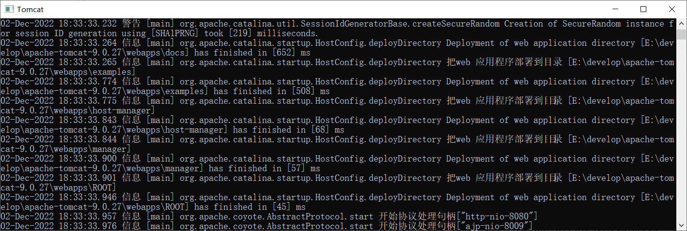
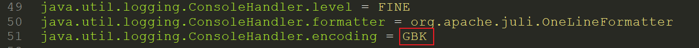
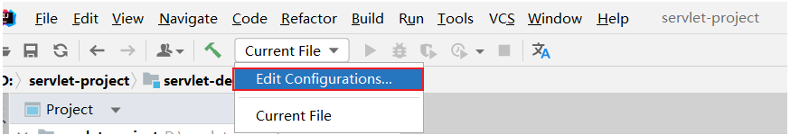
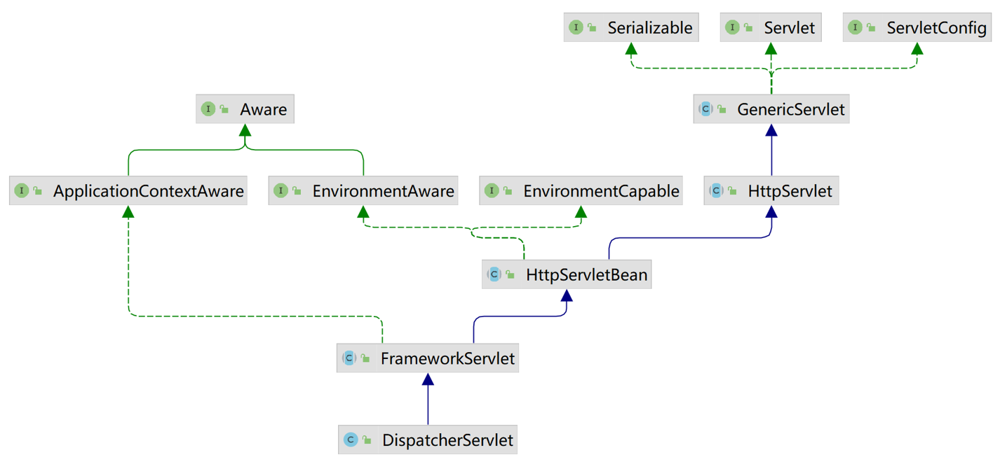

# Web基础知识

## 课程内容

> 1. SpringBootWeb入门
>
> 2. HTTP协议
>
> 3. Web服务器-Tomcat


## 1. Tomcat

### 1.1 简介

Tomcat服务器软件是一个免费的开源的web应用服务器。是Apache软件基金会的一个核心项目。由Apache，Sun和其他一些公司及个人共同开发而成。

由于Tomcat只支持Servlet/JSP少量JavaEE规范，所以是一个开源免费的轻量级Web服务器。

> JavaEE规范：   JavaEE => Java Enterprise Edition(Java企业版)
>
> avaEE规范就是指Java企业级开发的技术规范总和。包含13项技术规范：JDBC、JNDI、EJB、RMI、JSP、Servlet、XML、JMS、Java IDL、JTS、JTA、JavaMail、JAF

因为Tomcat支持Servlet/JSP规范，所以Tomcat也被称为Web容器、Servlet容器。JavaWeb程序需要依赖Tomcat才能运行。

Tomcat的官网: https://tomcat.apache.org/ 

  


### 1.2 基本使用

#### 1.2.1 下载

直接从官方网站下载：https://tomcat.apache.org/download-90.cgi

 

  

> Tomcat软件类型说明：
>
> - tar.gz文件，是linux和mac操作系统下的压缩版本
> - zip文件，是window操作系统下压缩版本（我们选择zip文件）

大家可以自行下载，也可以直接使用资料中已经下载好的资源，

Tomcat的软件程序  ：/资料/安装包/apache-tomcat-9.0.27-windows-x64.zip

   

 


#### 1.2.2 安装与卸载

**安装:** Tomcat是绿色版，直接解压即安装

> 在E盘的develop目录下，将`apache-tomcat-9.0.27-windows-x64.zip`进行解压缩，会得到一个`apache-tomcat-9.0.27`的目录，Tomcat就已经安装成功。

  

注意，Tomcat在解压缩的时候，解压所在的目录可以任意，但最好解压到一个不包含中文和空格的目录，因为后期在部署项目的时候，如果路径有中文或者空格可能会导致程序部署失败


打开`apache-tomcat-9.0.27`目录就能看到如下目录结构，每个目录中包含的内容需要认识下

   

bin：目录下有两类文件，一种是以`.bat`结尾的，是Windows系统的可执行文件，一种是以`.sh`结尾的，是Linux系统的可执行文件。

webapps：就是以后项目部署的目录


**卸载：**卸载比较简单，可以直接删除目录即可


#### 1.2.3 启动与关闭

**启动Tomcat** 

- 双击tomcat解压目录/bin/**startup.bat**文件即可启动tomcat

   

注意: tomcat服务器启动后,黑窗口不会关闭,只要黑窗口不关闭,就证明tomcat服务器正在运行



Tomcat的默认端口为8080，所以在浏览器的地址栏输入：`http://127.0.0.1:8080` 即可访问tomcat服务器

> 127.0.0.1 也可以使用localhost代替。如：`http://localhost:8080`

 

- 能看到以上图片中Apache Tomcat的内容就说明Tomcat已经启动成功

**注意事项** ：Tomcat启动的过程中，遇到控制台有中文乱码时，可以通常修改conf/logging.prooperties文件解决

 


**关闭:**  关闭有三种方式 

1、强制关闭：直接x掉Tomcat窗口（不建议）


2、正常关闭：bin\shutdown.bat

  

3、正常关闭：在Tomcat启动窗口中按下 Ctrl+C

- 说明：如果按下Ctrl+C没有反映，可以多按几次


#### 1.2.4 常见问题

**问题1：Tomcat启动时，窗口一闪而过**

- 检查JAVA_HOME环境变量是否正确配置


**问题2：端口号冲突**

 

- 发生问题的原因：Tomcat使用的端口被占用了。

- 解决方案：换Tomcat端口号
  - 要想修改Tomcat启动的端口号，需要修改 conf/server.xml文件

 

> 注: HTTP协议默认端口号为80，如果将Tomcat端口号改为80，则将来访问Tomcat时，将不用输入端口号。


## 2. Servlet

### 2.1 快速入门

#### 2.1.1 什么是Servlet

Servlet 是运行在Web服务器中的小型java程序，是Java提供的一门动态web资源开发技术。通常通过HTTP协议接收和响应来自于客户端的请求。

Servlet 是JavaEE规范之一，其实就是一个接口(定义Servlet需实现Servlet接口 或 继承HttpServlet) ，并由web服务器运行Servlet。

 


#### 2.1.2 入门程序

**需求：**使用Servlet开发一个Web应用，浏览器发起请求 /hello 之后，给浏览器返回一个字符串 "Hello Xxx"。

 


**步骤：**

1). 准备：创建maven项目（设置打包方式为war），导入Servlet坐标（provided）

```xml
<dependency>
    <groupId>javax.servlet</groupId>
    <artifactId>javax.servlet-api</artifactId>
    <version>4.0.1</version>
    <scope>provided</scope>
</dependency>
```


2). 定义一个类，实现Servlet接口（继承HttpServlet），并实现所有方法。在Servlet类上使用@WebServlet注解，配置该Servlet的访问路径。

```java
@WebServlet(urlPatterns = "/hello")
public class HelloServlet2 extends HttpServlet {
    @Override
    protected void doGet(HttpServletRequest request, HttpServletResponse response) throws ServletException, IOException {
        //接收请求参数
        String name = request.getParameter("name");
        //响应结果
        String respMsg = "<h1>Hello, " + name + " ~</h1>";
        response.getWriter().write(respMsg);
    }

    @Override
    protected void doPost(HttpServletRequest request, HttpServletResponse response) throws ServletException, IOException {
        doGet(request, response);
    }
}
```


3). 将开发好的Servlet部署在外部的Tomcat服务器中运行。

选择  `Edit Configurations`。

 


选择 `Tomcat Server`。

 


点击 `Deployment` 选择要部署的项目。

 


点击上方的小三角 ，启动Tomcat 服务。

 


启动完毕，会看到Tomcat输出的日志。

 


4). 打开浏览器，访问测试 `http://localhost:9000/demo01/hello`

 


#### 2.1.3 注意事项

1. Servlet项目打包方式需要设置为 war。

   ```xml
   <packaging>war</packaging>
   ```

2. servlet-api 依赖的作用范围 `<scope>`必须设置为 `provided`。

   ```xml
   <scope>provided</scope>
   ```

   


### 2.2 执行流程

Servlet的入门程序我们都已经完成了，并将其部署到了Tomcat服务器中进行测试，可以正常访问到Servlet程序。 那接下来，我们就来研究一下Servlet的执行流程。

研究Servlet的执行流程，主要就是研究，我们在浏览器地址栏访问 `http://localhost:8080/servlet-demo/hello?name=Tomcat`，是如何访问到我们的服务中部署的`servlet-demo`这个应用的。

1). 定位服务器

通过url地址中的ip/主机 与 端口号 `http://localhost:8080`，首先会定位到我们要访问的Web服务器。

 

而在一个web服务器中，是可以部署多个应用程序的。那我们具体要访问到那个项目呢 ？ 接下来，我们再来看如何定位到要访问的应用程序的。


2). 定位项目

通过端口号之后的 `servlet-demo`，就可以定位到Web服务器中部署的应用。

  

而我们知道在一个应用中呢，是可以有多个Servlet程序的，那如何定位到要访问的是哪一个Servlet呢 ？


3). 定位Servlet

那么通过请求路径中的最后一个部分 `/hello` 就可以知道我们要访问的Servlet程序是 `HelloServlet`，因为 `HelloServlet` 的请求路径是 `/hello`。

 


4). 执行Servlet

定位到Servlet程序后，那接下来，就会指定这个Servlet程序，那具体调用Servlet程序中的哪个方法呢 (`doGet` 或 `doPost`) ?

由于我们再浏览器地址栏发起的请求，请求方式都是Get，所以Web服务器会自动调用Servlet的 `doGet` 方法。

 


 

- Servlet 对象是由谁创建的，Servlet的doGet方法是由谁调用的？ 
  - Servlet对象由Web服务器创建，Servlet方法由Web服务器调用。
- HttpServletRequest：用于封装所有的请求数据。
- HttpServletResponse：用于封装所有的响应数据。


## 3. HTTP协议

### 3.1 HTTP-概述

#### 3.1.1 介绍

 

HTTP：Hyper Text Transfer Protocol(超文本传输协议)，规定了浏览器与服务器之间数据传输的规则。

- http是互联网上应用最为广泛的一种网络协议 
- http协议要求：浏览器在向服务器发送请求数据时，或是服务器在向浏览器发送响应数据时，都必须按照固定的格式进行数据传输


如果想知道http协议的数据传输格式有哪些，可以打开浏览器，点击`F12`打开开发者工具，点击`Network`来查看

 


浏览器向服务器进行请求时：

- 服务器按照固定的格式进行解析


服务器向浏览器进行响应时：

- 浏览器按照固定的格式进行解析

 

**所以，我们学习HTTP主要就是学习请求和响应数据的具体格式内容。**


#### 3.1.2 特点

我们刚才初步认识了HTTP协议，那么我们在看看HTTP协议有哪些特点：

* **基于TCP协议: **   面向连接，安全

  > TCP是一种面向连接的(建立连接之前是需要经过三次握手)、可靠的、基于字节流的传输层通信协议，在数据传输方面更安全

* **基于请求-响应模型:**   一次请求对应一次响应（先请求后响应）

  > 请求和响应是一一对应关系，没有请求，就没有响应

* **HTTP协议是无状态协议:**  对于数据没有记忆能力。每次请求-响应都是独立的

  > 无状态指的是客户端发送HTTP请求给服务端之后，服务端根据请求响应数据，响应完后，不会记录任何信息。
  >
  > - 缺点:  多次请求间不能共享数据
  > - 优点:  速度快
  >
  > 请求之间无法共享数据会引发的问题：
  >
  > - 如：京东购物。加入购物车和去购物车结算是两次请求
  > - 由于HTTP协议的无状态特性，加入购物车请求响应结束后，并未记录加入购物车是何商品
  > - 发起去购物车结算的请求后，因为无法获取哪些商品加入了购物车，会导致此次请求无法正确展示数据
  >
  > 具体使用的时候，我们发现京东是可以正常展示数据的，原因是Java早已考虑到这个问题，并提出了使用会话技术(Cookie、Session)来解决这个问题。具体如何来做，我们后面课程中会讲到。

  刚才提到HTTP协议是规定了请求和响应数据的格式，那具体的格式是什么呢?


### 3.2 HTTP-请求协议

浏览器和服务器是按照HTTP协议进行数据通信的。

HTTP协议又分为：请求协议和响应协议

- 请求协议：浏览器将数据以请求格式发送到服务器
  - 包括：**请求行**、**请求头** 、**请求体** 
- 响应协议：服务器将数据以响应格式返回给浏览器
  - 包括：**响应行** 、**响应头** 、**响应体** 


#### 3.2.1 请求数据格式

在HTTP1.1版本中，浏览器访问服务器的几种方式： 

| 请求方式 | 请求说明                                                     |
| :------: | :----------------------------------------------------------- |
| **GET**  | 获取资源。<br/>向特定的资源发出请求。例：http://www.baidu.com/s?wd=itheima |
| **POST** | 传输实体主体。<br/>向指定资源提交数据进行处理请求（例：上传文件），数据被包含在请求体中。 |
| OPTIONS  | 返回服务器针对特定资源所支持的HTTP请求方式。<br/>因为并不是所有的服务器都支持规定的方法，为了安全有些服务器可能会禁止掉一些方法，例如：DELETE、PUT等。那么OPTIONS就是用来询问服务器支持的方法。 |
|   HEAD   | 获得报文首部。<br/>HEAD方法类似GET方法，但是不同的是HEAD方法不要求返回数据。通常用于确认URI的有效性及资源更新时间等。 |
|   PUT    | 传输文件。<br/>PUT方法用来传输文件。类似FTP协议，文件内容包含在请求报文的实体中，然后请求保存到URL指定的服务器位置。 |
|  DELETE  | 删除文件。<br/>请求服务器删除Request-URI所标识的资源         |
|  TRACE   | 追踪路径。<br/>回显服务器收到的请求，主要用于测试或诊断      |
| CONNECT  | 要求用隧道协议连接代理。<br/>HTTP/1.1协议中预留给能够将连接改为管道方式的代理服务器 |

在我们实际应用中常用的也就是 ：**GET、POST**


**GET方式的请求协议：**

 

* 请求行 ：HTTP请求中的第一行数据。由：`请求方式`、`资源路径`、`协议/版本`组成（之间使用空格分隔）

  * 请求方式：GET  
  * 资源路径：/brand/findAll?name=OPPO&status=1
    * 请求路径：/brand/findAll
    * 请求参数：name=OPPO&status=1
      * 请求参数是以key=value形式出现
      * 多个请求参数之间使用`&`连接
    * 请求路径和请求参数之间使用`?`连接 			 
  * 协议/版本：HTTP/1.1  

* 请求头 ：第二行开始，上图黄色部分内容就是请求头。格式为key: value形式 

  - http是个无状态的协议，所以在请求头设置浏览器的一些自身信息和想要响应的形式。这样服务器在收到信息后，就可以知道是谁，想干什么了

  常见的HTTP请求头有:

  ~~~
  Host: 表示请求的主机名
  
  User-Agent: 浏览器版本。 例如：Chrome浏览器的标识类似Mozilla/5.0 ...Chrome/79 ，IE浏览器的标识类似Mozilla/5.0 (Windows NT ...)like Gecko
  
  Accept：表示浏览器能接收的资源类型，如text/*，image/*或者*/*表示所有；
  
  Accept-Language：表示浏览器偏好的语言，服务器可以据此返回不同语言的网页；
  
  Accept-Encoding：表示浏览器可以支持的压缩类型，例如gzip, deflate等。
  
  Content-Type：请求主体的数据类型
  
  Content-Length：数据主体的大小（单位：字节）
  ~~~

> 举例说明：服务端可以根据请求头中的内容来获取客户端的相关信息，有了这些信息服务端就可以处理不同的业务需求。
>
> 比如:
>
> - 不同浏览器解析HTML和CSS标签的结果会有不一致，所以就会导致相同的代码在不同的浏览器会出现不同的效果
> - 服务端根据客户端请求头中的数据获取到客户端的浏览器类型，就可以根据不同的浏览器设置不同的代码来达到一致的效果（这就是我们常说的浏览器兼容问题）

- 请求体 ：存储请求参数
  - GET请求的请求参数在请求行中，故不需要设置请求体


**POST方式的请求协议：**	

 


- 请求行(以上图中红色部分)：包含请求方式、资源路径、协议/版本
  - 请求方式：POST
  - 资源路径：/brand
  - 协议/版本：HTTP/1.1
- 请求头(以上图中黄色部分)   
- 请求体(以上图中绿色部分) ：存储请求参数 
  - 请求体和请求头之间是有一个空行隔开（作用：用于标记请求头结束）


GET请求和POST请求的区别：

| 区别方式     | GET请求                                                      | POST请求             |
| ------------ | ------------------------------------------------------------ | -------------------- |
| 请求参数     | 请求参数在请求行中。<br/>例：/brand/findAll?name=OPPO&status=1 | 请求参数在请求体中   |
| 请求参数长度 | 请求参数长度有限制(浏览器不同限制也不同)                     | 请求参数长度没有限制 |
| 安全性       | 安全性低。原因：请求参数暴露在浏览器地址栏中。               | 安全性相对高         |


#### 3.2.2 请求数据获取

Web服务器对HTTP协议的请求数据进行解析，并进行了封装(HttpServletRequest)，并在调用Servlet方法的时候传递给了Servlet。这样，就使得程序员不必直接对协议进行操作，让Web开发更加便捷。

 


代码演示：

```java
@WebServlet(urlPatterns = "/req")
public class RequestServlet extends HttpServlet {

    @Override
    protected void doGet(HttpServletRequest request, HttpServletResponse response) throws ServletException, IOException {
        //1. 获取请求方式 ;
        String method = request.getMethod();
        //2. 获取请求路径 ;
        String uri = request.getRequestURI();
        StringBuffer url = request.getRequestURL();
        //3. 获取请求参数 ;
        String name = request.getParameter("name");
        //4. 获取请求头 ;
        String ua = request.getHeader("User-Agent");
        //5. 获取请求协议 ;
        String scheme = request.getScheme();
        //6. 获取查询字符串 ;
        String queryString = request.getQueryString();

        System.out.println("method: "+method);
        System.out.println("uri: "+uri);
        System.out.println("url: "+url);
        System.out.println("name: "+name);
        System.out.println("ua: "+ua);
        System.out.println("scheme: "+scheme);
        System.out.println();
    }

    @Override
    protected void doPost(HttpServletRequest req, HttpServletResponse resp) throws ServletException, IOException {
        doGet(req, resp);
        ServletInputStream inputStream = req.getInputStream();
        System.out.println(IOUtils.toString(inputStream, "UTF-8"));
    }
}
```


### 3.3 HTTP-响应协议

#### 3.3.1 响应数据格式

##### 3.3.1.1 格式介绍

与HTTP的请求一样，HTTP响应的数据也分为3部分：**响应行**、**响应头** 、**响应体** 

 

* 响应行(以上图中红色部分)：响应数据的第一行。响应行由`协议及版本`、`响应状态码`、`状态码描述`组成

  * 协议/版本：HTTP/1.1
  * 响应状态码：200
  * 状态码描述：OK

* 响应头(以上图中黄色部分)：响应数据的第二行开始。格式为key：value形式

  * http是个无状态的协议，所以可以在请求头和响应头中设置一些信息和想要执行的动作，这样，对方在收到信息后，就可以知道你是谁，你想干什么

  常见的HTTP响应头有:

  ~~~
  Content-Type：表示该响应内容的类型，例如text/html，image/jpeg ；
  
  Content-Length：表示该响应内容的长度（字节数）；
  
  Content-Encoding：表示该响应压缩算法，例如gzip ；
  
  Cache-Control：指示客户端应如何缓存，例如max-age=300表示可以最多缓存300秒 ;
  
  Set-Cookie: 告诉浏览器为当前页面所在的域设置cookie ;
  ~~~

- 响应体(以上图中绿色部分)： 响应数据的最后一部分。存储响应的数据
  - 响应体和响应头之间有一个空行隔开（作用：用于标记响应头结束）


##### 3.3.1.2 响应状态码

| 状态码分类 | 说明                                                         |
| ---------- | ------------------------------------------------------------ |
| 1xx        | **响应中** --- 临时状态码。表示请求已经接受，告诉客户端应该继续请求或者如果已经完成则忽略 |
| 2xx        | **成功** --- 表示请求已经被成功接收，处理已完成              |
| 3xx        | **重定向** --- 重定向到其它地方，让客户端再发起一个请求以完成整个处理 |
| 4xx        | **客户端错误** --- 处理发生错误，责任在客户端，如：客户端的请求一个不存在的资源，客户端未被授权，禁止访问等 |
| 5xx        | **服务器端错误** --- 处理发生错误，责任在服务端，如：服务端抛出异常，路由出错，HTTP版本不支持等 |

参考: 资料/响应状态码.md

关于响应状态码，我们先主要认识三个状态码，其余的等后期用到了再去掌握：

* `200 ok`   客户端请求成功
* `404 Not Found`  请求资源不存在
* `500 Internal Server Error`  服务端发生不可预期的错误


#### 3.3.2 响应数据设置

Web服务器对HTTP协议的响应数据进行了封装(HttpServletResponse)，并在调用Servlet方法的时候传递给了Servlet。这样，就使得程序员不必直接对协议进行操作，让Web开发更加便捷。

 


代码演示：

```java
@WebServlet(urlPatterns = "/resp")
public class ResponseServlet extends HttpServlet {

    @Override
    protected void doGet(HttpServletRequest req, HttpServletResponse resp) throws ServletException, IOException {
        //1. 设置响应状态码
        //resp.setStatus(HttpServletResponse.SC_INTERNAL_SERVER_ERROR);
        //2. 设置响应头
        resp.setHeader("Content-Type", "text/html;charset=UTF-8");
        //3. 设置响应体 - 获取字符输出流
        resp.getWriter().write("<h1>Hello HTTP ~</h1>");
    }

}

```

响应状态码 和 响应头如果没有特殊要求的话，通常不手动设定。服务器会根据请求处理的逻辑，自动设置响应状态码和响应头。


## 4. SpringBootWeb入门

刚才我们讲解了基于原始的Servlet程序开发Web应用，并基于此讲解了Http协议。 那接下来呢，我们就要来讲解现在企业开发的主流技术 SpringBoot，并基于SpringBoot进行Web程序的开发 。

### 4.1 概述

在没有正式的学习SpringBoot之前，我们要先来了解下什么是Spring。

我们可以打开Spring的官网(https://spring.io)，去看一下Spring的简介：Spring makes Java simple。


Spring的官方提供很多开源的项目，我们可以点击上面的projects，看到spring家族旗下的项目，按照流行程度排序为：

 


Spring发展到今天已经形成了一种开发生态圈，Spring提供了若干个子项目，每个项目用于完成特定的功能。而我们在项目开发时，一般会偏向于选择这一套spring家族的技术，来解决对应领域的问题，那我们称这一套技术为**spring全家桶**。


而Spring家族旗下这么多的技术，最基础、最核心的是 SpringFramework。其他的spring家族的技术，都是基于SpringFramework的，SpringFramework中提供很多实用功能，如：依赖注入、事务管理、web开发支持、数据访问、消息服务等等。


而如果我们在项目中，直接基于SpringFramework进行开发，存在两个问题：配置繁琐、入门难度大。 


所以基于此呢，spring官方推荐我们从另外一个项目开始学习，那就是目前最火爆的SpringBoot。 

通过springboot就可以快速的帮我们构建应用程序，所以springboot呢，最大的特点有两个 ：

- 简化配置
- 快速开发

**Spring Boot 可以帮助我们非常快速的构建应用程序、简化开发、提高效率 。**


接下来，我们就直接通过一个SpringBoot的web入门程序，让大家快速感受一下，基于SpringBoot进行Web开发的便捷性。


### 4.2 入门程序

#### 4.2.1 需求

需求：基于SpringBoot的方式开发一个web应用，浏览器发起请求/hello后，给浏览器返回字符串 "Hello World ~"。

 

 

#### 4.2.2 开发步骤

第1步：创建SpringBoot工程，并勾选Web开发相关依赖

第2步：定义HelloController类，添加方法hello，并添加注解

第3步：测试运行


**1). 创建SpringBoot工程（需要联网）**

基于Spring官方骨架，创建SpringBoot工程。

 

基本信息描述完毕之后，勾选web开发相关依赖。

 

点击Finish之后，就会联网创建这个SpringBoot工程，创建好之后，结构如下：

 


<font color='red'>注意：在联网创建过程中，会下载相关资源(请耐心等待) </font>

 


**2). 定义请求处理类**

在com.itheima这个包下新建一个类：HelloController

   

```java
package com.itheima;

import org.springframework.web.bind.annotation.RequestMapping;
import org.springframework.web.bind.annotation.RestController;

@RestController
public class HelloController {

    @RequestMapping("/hello")
    public String hello(String name){
        System.out.println("HelloController .... hello : " + name);
        return "Hello , " + name;
    }

}

```


**3). 运行测试**

运行SpringBoot自动生成的引导类

 

 

打开浏览器，输入 `http://localhost:8080/hello?name=itheima`

 


### 4.3 入门程序解析

入门程序我们已经搞定了，接下来，我们就一起来解析一下我们所编写的入门程序。  


**4.3.1 main方法如何启动Tomcat ？**

 

因为我们在创建springboot项目的时候，选择了web开发的起步依赖 spring-boot-starter-web。而spring-boot-starter-web依赖，又依赖了spring-boot-starter-tomcat，由于maven的依赖传递特性，那么在我们创建的springboot项目中也就已经有了tomcat的依赖，这个其实就是springboot中内嵌的tomcat。 

而我们运行引导类中的main方法，其实启动的就是springboot中内嵌的Tomcat服务器。 而我们所开发的项目，也会自动的部署在该tomcat服务器中，并占用8080端口号 。 

 


**4.3.2 Tomcat是一个servlet容器，为什么可以运行我们编写的HelloController？**

首先，大家需要知道，Tomcat是一个Servlet容器，而我们编写的Controller程序是不能被Tomcat服务器识别的。 

 

那我们在浏览器地址栏访问 `http://localhost:8080/hello?name=Tom` 时是如何访问到HelloController程序的呢？ 这是因为啊，虽然我们没有编写Servlet程序，但是呢，在Springboot框架的底层源码中，给我们提供了一个核心的Servlet程序，叫	`DispatcherServlet`。 

 

而`DispatcherServlet`是一个Servlet程序，继承了HttpServlet。

 

前端发起的所有请求到达服务器之后，都会被DispatcherServlet接收并处理，而DispatcherServlet并不会直接对请求进行处理，而是将请求转发给后面我们自己编写的Controller程序，最终有Controller程序来进行请求的处理。

所以，我们基于Springboot进行Web程序的开发，是不需要直接编写原始的Servlet程序的，我们只需要编写Controller程序，来接收请求，响应数据即可。


